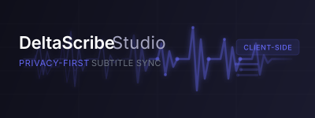

# DeltaScribe Studio



DeltaScribe is a sleek, premium, client-side subtitle and lyric timing synchronization studio built with React, Vite, and TypeScript. 

It is designed to align subtitles and audio/video files completely in the browser—meaning **no media files or subtitles are ever uploaded to a server**, keeping your workflows private, secure, and fast.

---

## Key Features

1. **Integrated Media Player**: Supports HTML5 video and audio playback natively. For audio tracks, a high-fidelity visualizer dashboard is displayed.
2. **Timing Anchors & Delta Offsets**: When importing subtitle files, the initial timings are captured as anchors. Delta timing boxes ($\Delta$) next to timestamps show the exact adjustments made in seconds ($+/-$) relative to the original file, allowing you to edit offsets directly or reset timings instantly using a rotation arrow.
3. **Multi-Format Subtitle Support (SRT, VTT, TTML)**: Fully parses and exports SRT, WebVTT (`.vtt`), and standard Timed Text Markup Language (`.ttml`/`.xml`) files, maintaining timings delta offsets and formatting features across all formats.
4. **Gated Visual Styling & Alignments**: Toggle layout formatting tools inside the editor:
   * **Alignments**: Set text alignments (Left, Center, Right) and vertical screen line coordinate offsets (Top, Middle, Bottom).
   * **Rich Text**: Visually edit text formatting (Bold, Italic, Underline) using a content-selection toolbar.
5. **Workspace URL Prepopulation**: Launch pre-configured workspaces directly by passing URLs as query string parameters:
   `/?media=HTTPS_MEDIA_URL&subtitles=HTTPS_SUBTITLE_URL&submit=HTTPS_POST_CALLBACK_URL`
6. **Self-Healing Remote CORS Streaming**: If remote media files lack CORS headers, DeltaScribe automatically falls back to stream them directly through standard browser decoding (so the player remains playable), only disabling the visualizer and warning the user.
7. **Submit Webhooks Callback**: If a `submit` URL is provided in the query string, a "Submit" button renders next to the export selector, allowing users to POST the final formatted subtitle payload back to their database/server.
8. **Speech-to-Text Sync Assistant**: Speak or play media out loud to capture real-time voice timestamps using the browser's native `SpeechRecognition` API.
9. **Chrome Gemini Nano & OpenAI AI Integrations**: Align subtitles automatically or translate text in-place using Chrome's local built-in AI (`window.ai.languageModel`) or any OpenAI-compatible API endpoint (such as Ollama, llama.cpp, or vLLM). Falls back to an offline sequential algorithmic mapping if AI models are disabled.
10. **Stable Timeline Indexing**: Caption cards remain anchored in their visual list positions while editing timings to prevent visual disorientation. Re-sorting and re-indexing occur only on exports, or after AI bulk actions.
11. **Dynamic Textareas**: Text boxes auto-resize based on input lines to keep all subtitle text fully visible.
12. **Read-Only / Text Safety Lock**: Toggle lock settings to prevent accidental edits to subtitle text lines while adjusting timings.
13. **Subtitle Scissors Splitting**: Easily split a subtitle cue in half, automatically slicing both text (by newline or word count) and timing intervals.
14. **Timing Scaling Mode**: Recalculate timing gaps dynamically across a track for live performances or drifted media by setting manual anchor points. DeltaScribe uses a piecewise linear interpolation algorithm to stretch and compress non-anchor timings between the anchors, with visual distinction (gold/amber for manual anchors, cyan/blue for auto-adjusted cues).
15. **Subtitle Overlap Validation & Adjustments**: Instantly detect caption collisions with real-time overlap warnings (red borders and `⚠️ Overlaps` badges) when editing endpoints. Fine-tune caption durations on the selected card with single-click `-0.5s` and `+0.5s` shift buttons, or stretch the end time precisely to snap to the beginning of the next subtitle.
16. **AI Subtitle Quality Inspector**: Scan loaded subtitle files for quality issues using local AI (Chrome Gemini Nano or custom OpenAI endpoints). Automatically audits character count lines (> 47 chars), text reading speeds (> 5 words/sec), formatting/grammar, and context line-splits, listing them with direct jump-to-seek timestamp hooks.
17. **Playback Auto-Seek Options & Direct Jump Controls**: Automatically seek the media player to a subtitle's start time when selected, with a toggleable 2-second lead-in context helper in the options drawer. Each subtitle card also renders a direct, inline Play/Seek button for manual jumping.

---

## Keyboard Shortcuts Reference

*   `Spacebar` - Play / Pause media playback.
*   `[` - Latch/sync the **Start** time of the selected subtitle card to the current player time.
*   `]` - Latch/sync the **End** time of the selected subtitle card to the current player time.
*   `Arrow Left` / `Arrow Right` - Seek backward or forward by 5 seconds.
*   `Shift + Arrow Left` / `Shift + Arrow Right` - Precise seek by 0.5 seconds.
*   `n` - Insert a new blank subtitle cue at the current playback position.

*Note: Hotkeys are automatically suspended when typing in text inputs, contenteditable editors, or textareas.*

---

## How to Get Started

### Prerequisites
- Node.js installed locally.
- A modern browser (Chrome or Edge recommended for voice transcribing and built-in AI support).

### Setup and Development

1. Install dependencies:
   ```bash
   npm install
   ```

2. Start the local server:
   ```bash
   npm run dev
   ```

3. Open **[http://localhost:5173/](http://localhost:5173/)** (or the port outputted in the console) to open DeltaScribe.

---

## URL Prepopulation & Integration Webhooks

DeltaScribe can be integrated into external content management platforms as a local editing component. Append the following GET query parameters to the URL:

*   `media`: The URL-encoded stream path to a video or audio file.
*   `subtitles`: The URL-encoded path to a remote SRT, VTT, or TTML file.
*   `submit`: The URL-encoded endpoint to POST the finished data back.
*   `format` *(optional)*: One of `srt`, `vtt`, or `ttml`. When present, the export format is
    locked to it and the format dropdown is disabled — use this when the `submit` endpoint only
    knows how to handle a single format, rather than parsing all three.
*   `lang` *(optional)*: A BCP-47 language code (e.g. `en`, `es`, `pt-BR`) used as the `xml:lang`
    attribute on TTML export/submission. Defaults to `en`.

**Example Link**:
```
http://localhost:5173/?media=https%3A%2F%2Fexample.com%2Fvideo.mp4&subtitles=https%3A%2F%2Fexample.com%2Fsubs.srt&submit=https%3A%2F%2Fexample.com%2Fapi%2Fsave-subtitles&format=ttml&lang=es
```

When users click the green **Submit** button, DeltaScribe makes a `POST` request to the `submit` URL carrying the following JSON payload:
```json
{
  "fileName": "remote_subtitles.srt",
  "format": "srt",
  "subtitles": "1\n00:00:01,000 --> 00:00:03,000\nHello World!",
  "cues": [
    {
      "index": 1,
      "startTime": 1.0,
      "endTime": 3.0,
      "text": "Hello World!",
      "align": "center",
      "line": "90%"
    }
  ]
}
```

If the `submit` request fails, DeltaScribe will try to read a JSON `{ "message": "..." }` body
from the (non-2xx) response and show that message to the user instead of a generic HTTP status,
so receiving servers should return a descriptive `message` on error where possible.

*Note: Remote media/subtitle files must be served with appropriate CORS headers (`Access-Control-Allow-Origin: *`) to enable browser fetching and audio visualization. Because the `submit` request is sent with `Content-Type: application/json`, browsers will first send a CORS preflight `OPTIONS` request to that endpoint — receiving servers must respond to `OPTIONS` with the appropriate `Access-Control-Allow-Origin`/`-Methods`/`-Headers` headers, not just the subsequent `POST`.*

---

## License

DeltaScribe Studio is free and open-source software licensed under the **GNU GPLv3 (or any later version)** to ensure compatibility with Apache 2.0 dependencies.

### Dependency Licenses

Our third-party dependencies are clustered below by license type:

#### MIT License
*   `react` (Core frontend framework library)
*   `react-dom` (React document interface renderer)
*   `lucide-react` (SVG icons package)
*   `vite` & `@vitejs/plugin-react` (Application builder and bundler plugins)
*   `oxlint` (Static analysis and code quality linter)
*   `@types/react`, `@types/react-dom`, `@types/node` (TypeScript type declarations)

#### Apache License 2.0
*   `typescript` (Typed scripting language compiler engine)
